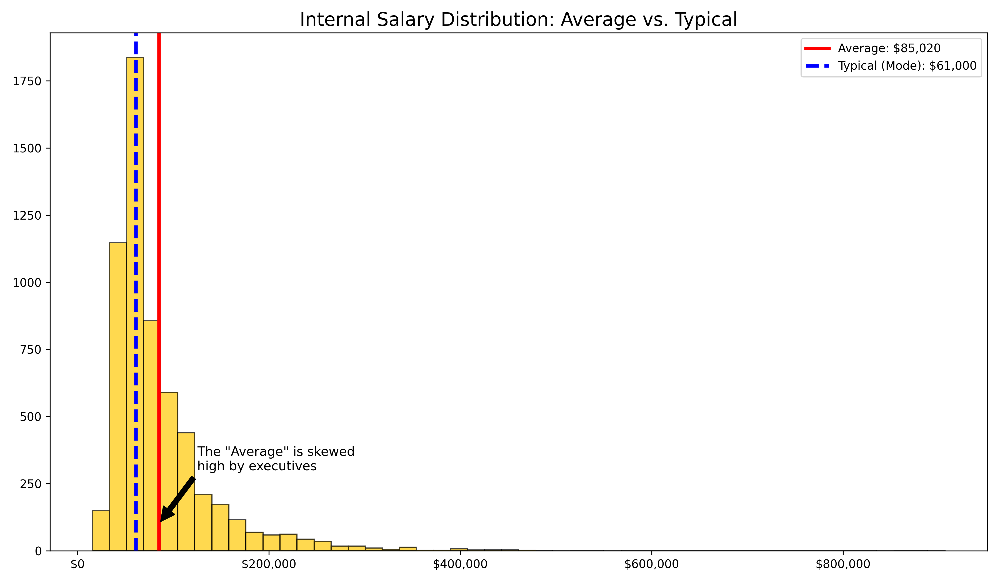
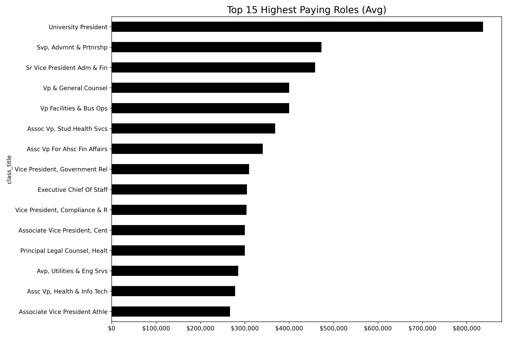
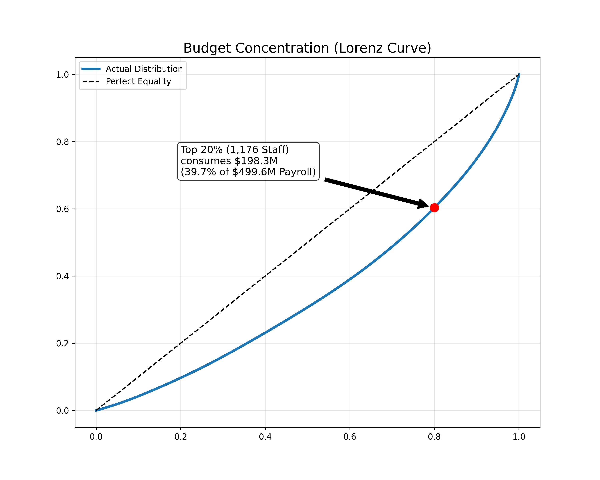
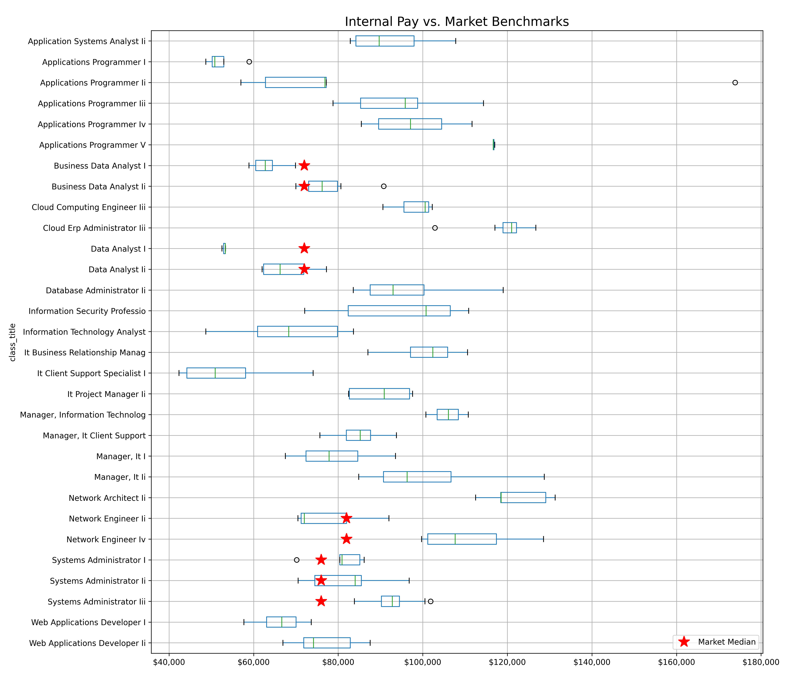

# UCF Strategic Compensation Analysis
**Project:** Budget Allocation & Market Competitiveness Model
**Role:** Data Science Consultant
**Stakeholder:** Chief Information Officer (CIO) & Executive Leadership
**Tech Stack:** Python, Pandas, Matplotlib

---

### Executive Summary
This project analyzes public salary data from the University of Central Florida to provide actionable intelligence on pay equity, budget concentration, and IT talent retention. The objective was to transform raw administrative data into a strategic dashboard that answers two critical business questions: *Is the current budget allocation optimized for retention?* and *Are critical IT roles competitive against the private sector?*

### Business Problem
Higher education institutions often face challenges with "salary compression"—where new hires command higher market rates than tenured staff—and inefficient budget distribution. Without granular visibility, leadership risks:
1.  **High Turnover in Critical Roles:** Losing technical talent to the private sector due to non-competitive pay bands.
2.  **Inefficient Resource Allocation:** Over-indexing budget increases on executive roles rather than operational baselines.
3.  **Hidden Pay Inequities:** Failing to identify disparities between the "average" salary and the "typical" employee experience.

### Data Pipeline & Methodology
* **Data Source:** Florida Board of Governors (FLBOG) Right-to-Know Database.
* **ETL Process:**
    * **Ingestion:** Developed an automated loading script with header detection to handle varying annual report formats.
    * **Filtering:** Engineered a strict filter to remove approximately 2,000 "OPS" (temporary) and Student Assistant records, isolating the professional full-time workforce (FTE) for accurate analysis.
    * **Aggregation:** Resolved "Split-Funding" anomalies where single employees appeared as multiple records due to grant funding; aggregated data by unique identifier to calculate true total compensation.

---

### Key Strategic Insights

#### 1. Internal Salary Distribution: The Mean vs. Mode Gap

**Finding:** The analysis reveals a significant disparity between the Mean Salary (Red Line) and the Mode Salary (Blue Line).
**Strategic Implication:** The "Average" salary is skewed upward by high-earning outliers. The Mode represents the most frequent salary band and is a more accurate reflection of the typical employee's financial reality. Compensation strategies based solely on "raising the average" may fail to address the needs of the core workforce.

#### 2. Resource Allocation: High-Budget Roles

**Finding:** Strategic leadership and senior faculty positions command the highest per-capita budget allocation.
**Strategic Implication:** While expected, the magnitude of the gap between these roles and operational staff highlights the "top-heavy" nature of the current compensation model.

#### 3. Budget Concentration Risk (Lorenz Curve)

**Finding:** The Lorenz Curve analysis demonstrates high budget concentration. As noted in the chart, the Top 20% of staff consume nearly 40% of the total payroll budget.
**Strategic Implication:** This concentration suggests that flat-percentage Cost of Living Adjustments (COLA) are fiscally inefficient, as they disproportionately benefit top earners while providing minimal relief to the operational base. A tiered adjustment model is recommended.

#### 4. IT Competitiveness: Internal Pay vs. Market Benchmarks

**Finding:** Internal salary bands were benchmarked against 2024 external market medians (indicated by Red Stars).
* **Risk Area:** "Network Engineers" and "Systems Administrators" are currently compensated below the market median, presenting a high risk of attrition to the private sector.
* **Stability:** "IT Support" roles are clustered competitively around the market rate, indicating stability in Tier 1 operations.

---

### Reproduction Instructions
1.  Clone this repository.
2.  Download the latest salary dataset from the [Florida Board of Governors Interactive Tool](https://prod.flbog.net/ords/f?p=140:1::::::).
3.  Place the `.csv` file in the root directory.
4.  Run the `UCF_Analysis.ipynb` notebook to reproduce the ETL pipeline and visualizations.

*Disclaimer: This analysis utilizes publicly available data for educational and portfolio purposes.*
